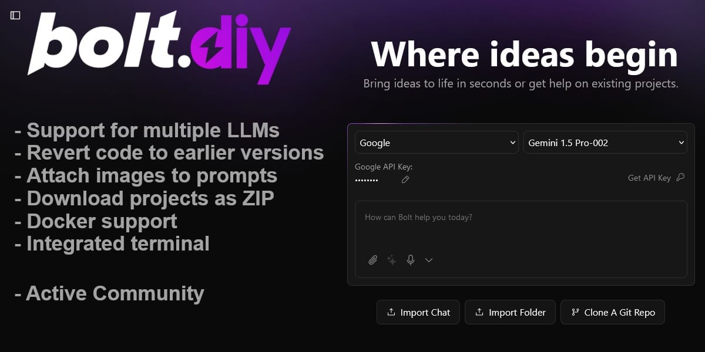

# Palmkit

[](https://palmkit.app)

**Palmkit** is an AI-powered full-stack development platform that turns natural-language prompts into running web apps. Describe what you want — Palmkit builds it, previews it, and lets you iterate.

> An independent project with a completely redesigned execution pipeline: external Oracle worker, Cloudflare R2 file storage, Supabase + Pages Function preview serving, and a phase-based roadmap to production quality. Originally inspired by [Bolt.diy](https://github.com/stackblitz-labs/bolt.diy).

---

## Table of Contents

- [What is Palmkit](#what-is-palmkit)
- [Tech Stack](#tech-stack)
- [Live Site](#live-site)
- [Quick Start](#quick-start)
- [Configuration](#configuration)
- [Architecture](#architecture)
- [Project Status & Roadmap](#project-status--roadmap)
- [Available Scripts](#available-scripts)
- [License](#license)

---

## What is Palmkit

Palmkit turns a natural-language prompt into a runnable app in seconds:

1. User describes an app ("Build a coffee shop landing page with hero, menu, contact form").
2. Palmkit enqueues a build job to the Oracle ARM64 worker via Supabase.
3. The Oracle worker calls an LLM with a structured generation prompt and writes files to Cloudflare R2.
4. Palmkit routes the preview based on app type:
   - **Static HTML/CSS/JS** → blob URL preview (instant, zero cost)
   - **React / Vue / Next.js on desktop** → WebContainer (free, in-browser WASM)
   - **React / Vue / Next.js on mobile** → E2B cloud sandbox (on-demand)
   - **Python** → E2B sandbox (always — needs server runtime)
   - **Flutter / React Native** → source download + run instructions
5. The preview renders live in an iframe.

**20+ LLM providers** supported: OpenAI, Anthropic, Google, Groq, xAI, DeepSeek, Mistral, Cohere, Together, Perplexity, HuggingFace, Ollama, LM Studio, OpenRouter, Moonshot, Hyperbolic, GitHub Models, Amazon Bedrock, OpenAI-like.

---

## Tech Stack

| Layer | Technology |
|-------|-----------|
| **Framework** | Remix + Vite |
| **Runtime** | Cloudflare Pages (Workers runtime) |
| **AI Providers** | OpenRouter + 19 others (via Vercel AI SDK) |
| **Auth + DB** | Supabase (Postgres + Auth + RLS) |
| **File Storage** | Cloudflare R2 (via S3-compatible API) |
| **Build Worker** | Oracle ARM64 (Bun, external worker) |
| **Desktop Preview** | WebContainer (`@webcontainer/api`) |
| **Mobile Preview** | E2B cloud sandbox |
| **Desktop App** | Electron |
| **Deploy Targets** | Netlify, Vercel, GitHub Pages |

---

## Live Site

- **Production**: https://palmkit.app
- **Cloudflare Pages project**: `mobile-ai-dev-workspace`
- **Repo**: https://github.com/6eu6/Palmkit

---

## Quick Start

### Prerequisites

- Node.js LTS
- pnpm (`npm install -g pnpm`)

### Local Development

```bash
pnpm install
cp .env.example .env.local
# Edit .env.local — set OPENROUTER_API_KEY and SUPABASE_* vars at minimum
pnpm run dev
```

App runs at `http://localhost:5173`.

### Docker

```bash
cp .env.example .env.local
pnpm run dockerbuild         # dev image
docker compose --profile development up
```

### Desktop (Electron)

```bash
pnpm install
pnpm electron:build:dist     # all platforms
# or: pnpm electron:build:mac / win / linux
```

Download a pre-built binary from [Releases](https://github.com/6eu6/Palmkit/releases/latest).

---

## Configuration

All configuration lives in `.env.local`. Key variables:

| Variable | Purpose |
|----------|---------|
| `OPENROUTER_API_KEY` | Default LLM provider |
| `SUPABASE_URL` / `SUPABASE_ANON_KEY` | Auth + job queue + metadata |
| `R2_ACCOUNT_ID` / `R2_ACCESS_KEY_ID` / `R2_SECRET_ACCESS_KEY` | File storage for built projects |
| `R2_BUCKET_NAME` | R2 bucket (default: `palmkit-files`) |
| `E2B_API_KEY` | Cloud sandbox for mobile users / Python apps |
| `VITE_DEPLOYMENT_PLATFORM_*` | Netlify / Vercel / GitHub deploy |

Provider API keys can also be entered per-user via the in-app **Edit API Key** dialog (stored server-side, never in localStorage).

See [`.env.example`](./.env.example) for the full list.

---

## Architecture

```
┌─────────────────────────────────────────────────────────────────┐
│ Browser (Remix SPA)                                              │
│  ├── Chat UI (streaming annotations)                             │
│  ├── Workbench (Monaco editor + file tree)                       │
│  ├── Preview iframe (blob URL / WebContainer / E2B)              │
│  └── Build status gate (prevents broken previews)                │
└──────────────────────────┬──────────────────────────────────────┘
                           │ HTTPS
┌──────────────────────────▼──────────────────────────────────────┐
│ Cloudflare Pages Function (Remix)                               │
│  ├── /api/chat       ← streaming LLM + validation annotations   │
│  ├── /api/jobs       ← enqueue / poll build jobs                │
│  ├── /api/files      ← proxy R2 files to frontend               │
│  └── /api/sb         ← E2B sandbox proxy (auth + rate-limit)    │
└──────────────────────────┬──────────────────────────────────────┘
                           │
        ┌──────────────────┼──────────────────────┐
        ▼                  ▼                       ▼
   Supabase           Oracle Worker           Cloudflare R2
   (jobs queue +      (Bun, ARM64)            (built files,
    auth + RLS)       LLM → files             10 GB free)
                      → R2 → done signal
                           │
               ┌───────────┴──────────┐
               ▼                      ▼
          WebContainer              E2B Sandbox
          (desktop, free)           (mobile / Python)
```

---

## Project Status & Roadmap

See [`ROADMAP.md`](./ROADMAP.md) for the full technical ledger and phase plan.

**Quick summary**:

| Phase | Status | Goal |
|-------|--------|------|
| **Phase 1 — Safety Gate** | ✅ Complete | Prevent broken previews; completion marker + validator + retry state machine |
| **Phase 2 — Build Orchestrator** | ✅ Complete | Oracle ARM64 worker + R2 storage; removes Cloudflare CPU limits |
| **Phase 3 — Sandbox Execution** | ✅ Complete | WebContainer (desktop) + E2B (mobile) for React/Vue/Next.js/Python |
| **Phase 4 — Build Verification** | 🔲 Planned | Real `npm run build` + auto-repair agent; zero broken React apps |
| **Phase 5 — SSE Progress Stream** | 🔲 Planned | Real-time file-by-file build progress UI |
| **Phase 6 — Project History** | 🔲 Planned | Save / re-open / export projects per user |
| **Phase 7 — Multi-turn Edit** | 🔲 Planned | Smart patch mode for incremental changes |
| **Phase 8 — Native App Delivery** | 🔲 Planned | Flutter web build, Expo QR, Python persistent backend |

---

## Available Scripts

| Script | Purpose |
|--------|---------|
| `pnpm run dev` | Start dev server (port 5173) |
| `pnpm run build` | Production build (Remix + Vite) |
| `pnpm run preview` | Build + serve locally |
| `pnpm run lint` | ESLint |
| `pnpm run typecheck` | `tsc --noEmit` |
| `pnpm run test` | Vitest |
| `pnpm run deploy` | Build + `wrangler pages deploy` |
| `pnpm run db:push` | Apply Supabase migrations (if configured) |
| `pnpm electron:build:*` | Build desktop binaries |

---


## Project Management

First off: this sounds funny, we know. "Project management" comes from a world of enterprise stuff and this project is
far from being enterprisy- it's still anarchy all over the place 😉

But we need to organize ourselves somehow, right?

> tl;dr: We've got a project board with epics and features. We use PRs as change log and as materialized features. Find it [here](https://github.com/orgs/stackblitz-labs/projects/4).

Here's how we structure long-term vision, mid-term capabilities of the software and short term improvements.

## Strategic epics (long-term)

Strategic epics define areas in which the product evolves. Usually, these epics don’t overlap. They shall allow the core
team to define what they believe is most important and should be worked on with the highest priority.

You can find the [epics as issues](https://github.com/6eu6/Palmkit/labels/epic) which are probably never
going to be closed.

What's the benefit / purpose of epics?

1. Prioritization

E. g. we could say “managing files is currently more important that quality”. Then, we could thing about which features
would bring “managing files” forward. It may be different features, such as “upload local files”, “import from a repo”
or also undo/redo/commit.

In a more-or-less regular meeting dedicated for that, the core team discusses which epics matter most, sketch features
and then check who can work on them. After the meeting, they update the roadmap (at least for the next development turn)
and this way communicate where the focus currently is.

2. Grouping of features

By linking features with epics, we can keep them together and document _why_ we invest work into a particular thing.

## Features (mid-term)

We all know probably a dozen of methodologies following which features are being described (User story, business
function, you name it).

However, we intentionally describe features in a more vague manner. Why? Everybody loves crisp, well-defined
acceptance-criteria, no? Well, every product owner loves it. because he knows what he’ll get once it’s done.

But: **here is no owner of this product**. Therefore, we grant _maximum flexibility to the developer contributing a feature_ – so that he can bring in his ideas and have most fun implementing it.

The feature therefore tries to describe _what_ should be improved but not in detail _how_.

## PRs as materialized features (short-term)

Once a developer starts working on a feature, a draft-PR _can_ be opened asap to share, describe and discuss, how the feature shall be implemented. But: this is not a must. It just helps to get early feedback and get other developers involved. Sometimes, the developer just wants to get started and then open a PR later.

In a loosely organized project, it may as well happen that multiple PRs are opened for the same feature. This is no real issue: Usually, peoply being passionate about a solution are willing to join forces and get it done together. And if a second developer was just faster getting the same feature realized: Be happy that it's been done, close the PR and look out for the next feature to implement 🤓

## PRs as change log

Once a PR is merged, a squashed commit contains the whole PR description which allows for a good change log.
All authors of commits in the PR are mentioned in the squashed commit message and become contributors 🙌

## License

[MIT](./LICENSE) — Palmkit is an independent open-source project. Originally inspired by [Bolt.diy](https://github.com/stackblitz-labs/bolt.diy) by the StackBlitz Labs community.
